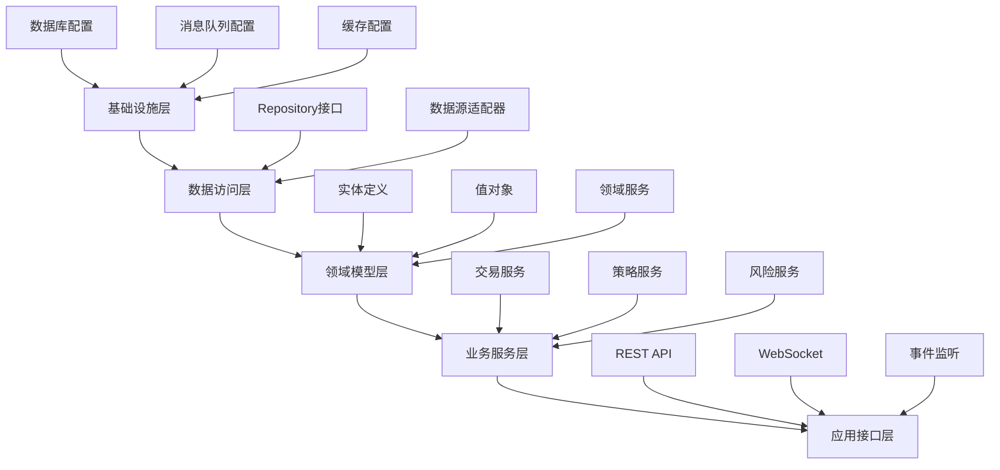

# 核心组件开发流程

## 12.1 开发流程总览

### 12.1.1 组件开发顺序


### 12.1.2 测试驱动开发流程
```java
// TDD开发循环
public class TDDWorkflow {
    // 1. 编写失败的测试
    @Test
    public void should_generate_buy_signal_when_all_layers_pass() {
        // Given
        MarketData data = createTestMarketData();
        SignalStrategy strategy = new FourLayerStrategy();
        
        // When
        Optional<TradingSignal> signal = strategy.evaluate(data);
        
        // Then
        assertTrue(signal.isPresent());
        assertEquals(SignalType.BUY, signal.get().getType());
    }
    
    // 2. 实现最小可工作代码
    // 3. 重构优化
    // 4. 重复循环
}
```

## 12.2 数据层组件开发

### 12.2.1 市场数据接入开发流程

#### 步骤1：定义数据模型
```java
// 1. 创建市场数据实体
@Entity
@Table(name = "market_data")
public class MarketData {
    @Id
    private String id;
    
    @Column(nullable = false)
    private String symbol;
    
    @Column(precision = 19, scale = 4)
    private BigDecimal open;
    private BigDecimal high;
    private BigDecimal low;
    private BigDecimal close;
    
    @Column(nullable = false)
    private Long volume;
    
    @Column(nullable = false)
    private LocalDateTime timestamp;
    
    @Embedded
    private TechnicalIndicators indicators;
    
    // 业务方法
    public boolean isValidForTrading() {
        return volume > 0 && close.compareTo(BigDecimal.ZERO) > 0;
    }
    
    public BigDecimal getTypicalPrice() {
        return high.add(low).add(close).divide(BigDecimal.valueOf(3), 
            4, RoundingMode.HALF_UP);
    }
}

// 2. 定义技术指标嵌入对象
@Embeddable
public class TechnicalIndicators {
    private BigDecimal atr;        // 平均真实范围
    private BigDecimal macdLine;   // MACD线
    private BigDecimal signalLine; // 信号线
    private BigDecimal histogram;  // MACD柱状图
    private BigDecimal upperBand;  // 布林带上轨
    private BigDecimal middleBand; // 布林带中轨
    private BigDecimal lowerBand;  // 布林带下轨
    private BigDecimal rsi;        // 相对强弱指标
    private BigDecimal volumeRatio;// 量比
}
```

#### 步骤2：实现数据源适配器
```java
@Component
public class FutuDataAdapter implements MarketDataSource {
    
    private final WebSocketClient wsClient;
    private final RedisTemplate<String, MarketData> cache;
    private final IndicatorCalculator calculator;
    
    @Override
    public Flux<MarketData> subscribeRealTimeData(String symbol) {
        return Flux.create(sink -> {
            wsClient.subscribe(symbol, rawData -> {
                try {
                    // 1. 解析原始数据
                    MarketData data = parseRawData(rawData);
                    
                    // 2. 计算技术指标
                    TechnicalIndicators indicators = 
                        calculator.calculate(symbol, data);
                    data.setIndicators(indicators);
                    
                    // 3. 验证数据质量
                    if (validateData(data)) {
                        // 4. 缓存数据
                        cacheData(symbol, data);
                        
                        // 5. 推送数据
                        sink.next(data);
                    }
                } catch (Exception e) {
                    sink.error(e);
                }
            });
        });
    }
    
    private boolean validateData(MarketData data) {
        // 数据完整性检查
        if (data.getOpen() == null || data.getClose() == null) {
            return false;
        }
        
        // 异常值检查
        BigDecimal changeRatio = data.getClose()
            .subtract(data.getOpen())
            .divide(data.getOpen(), 4, RoundingMode.HALF_UP)
            .abs();
            
        if (changeRatio.compareTo(BigDecimal.valueOf(0.2)) > 0) {
            log.warn("异常波动: {}", changeRatio);
            return false;
        }
        
        return true;
    }
}
```

#### 步骤3：数据质量控制测试
```java
@SpringBootTest
public class MarketDataAdapterTest {
    
    @MockBean
    private WebSocketClient wsClient;
    
    @Autowired
    private FutuDataAdapter adapter;
    
    @Test
    public void should_filter_invalid_data() {
        // Given - 无效数据（缺少收盘价）
        String rawData = "{\"symbol\":\"00700\",\"open\":350.0}";
        
        // When
        StepVerifier.create(adapter.subscribeRealTimeData("00700"))
            .expectNextCount(0)  // 期望无数据输出
            .thenCancel()
            .verify();
    }
    
    @Test
    public void should_handle_connection_failure() {
        // Given - 连接失败
        when(wsClient.subscribe(any(), any()))
            .thenThrow(new ConnectionException("连接失败"));
        
        // When & Then
        StepVerifier.create(adapter.subscribeRealTimeData("00700"))
            .expectError(ConnectionException.class)
            .verify();
    }
}
```

## 12.3 信号生成组件开发

### 12.3.1 四层过滤器实现步骤

#### 步骤1：创建策略框架
```java
// 1. 定义策略接口
public interface SignalStrategy {
    Optional<TradingSignal> evaluate(MarketData data);
    BigDecimal getWeight();
    String getName();
    boolean isEnabled();
}

// 2. 抽象基类
public abstract class BaseSignalStrategy implements SignalStrategy {
    
    protected final Logger logger = LoggerFactory.getLogger(getClass());
    protected final StrategyConfig config;
    
    @Override
    public Optional<TradingSignal> evaluate(MarketData data) {
        if (!isEnabled()) {
            return Optional.empty();
        }
        
        try {
            // 1. 预检查
            if (!preCheck(data)) {
                return Optional.empty();
            }
            
            // 2. 计算分数
            BigDecimal score = calculateScore(data);
            
            // 3. 生成信号
            if (score.compareTo(getThreshold()) >= 0) {
                return Optional.of(createSignal(data, score));
            }
            
            return Optional.empty();
            
        } catch (Exception e) {
            logger.error("策略评估失败: {}", e.getMessage(), e);
            return Optional.empty();
        }
    }
    
    protected abstract boolean preCheck(MarketData data);
    protected abstract BigDecimal calculateScore(MarketData data);
    protected abstract BigDecimal getThreshold();
    protected abstract TradingSignal createSignal(
        MarketData data, BigDecimal score);
}
```

#### 步骤2：实现各层策略
```java
// 波动率层实现
@Component
public class VolatilityStrategy extends BaseSignalStrategy {
    
    @Value("${strategy.volatility.weight:0.15}")
    private BigDecimal weight;
    
    @Value("${strategy.volatility.min-atr:0.005}")
    private BigDecimal minAtr;
    
    @Value("${strategy.volatility.max-atr:0.05}")
    private BigDecimal maxAtr;
    
    @Override
    protected BigDecimal calculateScore(MarketData data) {
        BigDecimal atr = data.getIndicators().getAtr();
        BigDecimal price = data.getClose();
        
        // ATR占价格比例
        BigDecimal atrRatio = atr.divide(price, 4, RoundingMode.HALF_UP);
        
        // 评分逻辑
        if (atrRatio.compareTo(minAtr) >= 0 && 
            atrRatio.compareTo(maxAtr) <= 0) {
            // 在理想区间内，线性评分
            BigDecimal range = maxAtr.subtract(minAtr);
            BigDecimal position = atrRatio.subtract(minAtr);
            BigDecimal normalizedScore = position.divide(range, 4, 
                RoundingMode.HALF_UP);
            
            // 转换为0-100分
            return normalizedScore.multiply(BigDecimal.valueOf(100));
        }
        
        return BigDecimal.ZERO;
    }
    
    @Override
    protected BigDecimal getThreshold() {
        return BigDecimal.valueOf(60);
    }
}

// 成交量层实现
@Component
public class VolumeStrategy extends BaseSignalStrategy {
    
    @Value("${strategy.volume.weight:0.25}")
    private BigDecimal weight;
    
    private final VolumeAnalyzer volumeAnalyzer;
    
    @Override
    protected BigDecimal calculateScore(MarketData data) {
        // 1. 计算量比
        BigDecimal volumeRatio = data.getIndicators().getVolumeRatio();
        
        // 2. 分析量价关系
        VolumePrice vp = volumeAnalyzer.analyze(data);
        
        // 3. 综合评分
        BigDecimal score = BigDecimal.ZERO;
        
        // 量比评分 (40分)
        if (volumeRatio.compareTo(BigDecimal.valueOf(1.2)) > 0) {
            score = score.add(BigDecimal.valueOf(40));
        }
        
        // 量价配合评分 (60分)
        if (vp.isPositiveDivergence()) {
            score = score.add(BigDecimal.valueOf(60));
        } else if (vp.isHealthy()) {
            score = score.add(BigDecimal.valueOf(30));
        }
        
        return score;
    }
}
```

#### 步骤3：策略组合器
```java
@Service
public class StrategyComposer {
    
    private final List<SignalStrategy> strategies;
    private final SignalAggregator aggregator;
    
    public Optional<TradingSignal> compose(MarketData data) {
        // 1. 并行评估所有策略
        Map<String, CompletableFuture<Optional<BigDecimal>>> futures = 
            strategies.stream()
                .collect(Collectors.toMap(
                    SignalStrategy::getName,
                    s -> CompletableFuture.supplyAsync(() -> 
                        s.evaluate(data)
                            .map(TradingSignal::getStrength)
                    )
                ));
        
        // 2. 等待所有结果
        CompletableFuture.allOf(futures.values().toArray(
            new CompletableFuture[0])).join();
        
        // 3. 收集评分
        Map<String, BigDecimal> scores = new HashMap<>();
        futures.forEach((name, future) -> {
            future.join().ifPresent(score -> scores.put(name, score));
        });
        
        // 4. 检查必须通过的层
        if (!allRequiredLayersPass(scores)) {
            return Optional.empty();
        }
        
        // 5. 计算加权总分
        BigDecimal totalScore = aggregator.aggregate(scores, strategies);
        
        // 6. 生成综合信号
        if (totalScore.compareTo(getOverallThreshold()) >= 0) {
            return Optional.of(createCompositeSignal(data, scores, totalScore));
        }
        
        return Optional.empty();
    }
}
```

## 12.4 风险管理组件开发

### 12.4.1 止损系统开发流程

#### 步骤1：止损规则实现
```java
// 止损策略接口
public interface StopLossStrategy {
    StopLossResult evaluate(Position position, MarketData currentData);
}

// ATR动态止损
@Component
public class ATRStopLoss implements StopLossStrategy {
    
    @Value("${risk.atr-multiplier:1.5}")
    private BigDecimal atrMultiplier;
    
    @Override
    public StopLossResult evaluate(Position position, MarketData data) {
        BigDecimal atr = data.getIndicators().getAtr();
        BigDecimal stopDistance = atr.multiply(atrMultiplier);
        
        BigDecimal stopPrice;
        if (position.getSide() == PositionSide.LONG) {
            stopPrice = position.getEntryPrice().subtract(stopDistance);
            
            if (data.getClose().compareTo(stopPrice) <= 0) {
                return StopLossResult.triggered(
                    "ATR止损触发", 
                    stopPrice,
                    calculateLoss(position, data.getClose())
                );
            }
        }
        
        return StopLossResult.notTriggered(stopPrice);
    }
}

// 跟踪止损
@Component
public class TrailingStopLoss implements StopLossStrategy {
    
    private final Map<String, BigDecimal> highWaterMarks = 
        new ConcurrentHashMap<>();
    
    @Value("${risk.trailing-stop-percent:0.05}")
    private BigDecimal trailingPercent;
    
    @Override
    public StopLossResult evaluate(Position position, MarketData data) {
        String positionId = position.getId();
        BigDecimal currentPrice = data.getClose();
        
        // 更新最高点
        highWaterMarks.compute(positionId, (k, v) -> 
            v == null ? currentPrice : v.max(currentPrice)
        );
        
        BigDecimal highWaterMark = highWaterMarks.get(positionId);
        BigDecimal trailingStop = highWaterMark.multiply(
            BigDecimal.ONE.subtract(trailingPercent)
        );
        
        if (currentPrice.compareTo(trailingStop) <= 0) {
            return StopLossResult.triggered(
                "跟踪止损触发",
                trailingStop,
                calculateLoss(position, currentPrice)
            );
        }
        
        return StopLossResult.notTriggered(trailingStop);
    }
}
```

#### 步骤2：仓位管理器
```java
@Service
public class PositionSizer {
    
    @Value("${risk.max-risk-per-trade:0.02}")
    private BigDecimal maxRiskPerTrade;
    
    private final AccountService accountService;
    private final RiskCalculator riskCalculator;
    
    public PositionSize calculate(TradingSignal signal, 
                                 BigDecimal stopLossPrice) {
        // 1. 获取账户余额
        BigDecimal accountBalance = accountService.getAvailableBalance();
        
        // 2. 计算风险金额
        BigDecimal riskAmount = accountBalance.multiply(maxRiskPerTrade);
        
        // 3. 计算每股风险
        BigDecimal entryPrice = signal.getSuggestedPrice();
        BigDecimal riskPerShare = entryPrice.subtract(stopLossPrice).abs();
        
        // 4. 计算仓位大小（Kelly公式简化版）
        BigDecimal winRate = signal.getWinProbability();
        BigDecimal profitRatio = signal.getProfitRatio();
        
        BigDecimal kellyFraction = winRate.subtract(
            BigDecimal.ONE.subtract(winRate).divide(profitRatio, 4, 
                RoundingMode.HALF_UP)
        );
        
        // 5. 应用Kelly比例（保守使用25%）
        BigDecimal adjustedFraction = kellyFraction
            .multiply(BigDecimal.valueOf(0.25));
        
        // 6. 计算最终仓位
        int shares = riskAmount
            .divide(riskPerShare, 0, RoundingMode.DOWN)
            .intValue();
        
        // 7. 应用仓位限制
        shares = applyPositionLimits(shares, signal);
        
        return new PositionSize(shares, entryPrice, stopLossPrice);
    }
}
```

#### 步骤3：风险验证链
```java
// 风险处理器基类
public abstract class RiskHandler {
    
    protected RiskHandler nextHandler;
    
    public void setNext(RiskHandler handler) {
        this.nextHandler = handler;
    }
    
    public RiskValidation handle(Order order) {
        // 1. 执行当前验证
        RiskValidation validation = validate(order);
        
        // 2. 如果失败，直接返回
        if (!validation.isPassed()) {
            return validation;
        }
        
        // 3. 传递给下一个处理器
        if (nextHandler != null) {
            return nextHandler.handle(order);
        }
        
        return validation;
    }
    
    protected abstract RiskValidation validate(Order order);
}

// 具体风险检查器
@Component
public class PositionLimitHandler extends RiskHandler {
    
    @Value("${risk.max-position-value:0.2}")
    private BigDecimal maxPositionValue;
    
    @Autowired
    private PositionRepository positionRepository;
    
    @Override
    protected RiskValidation validate(Order order) {
        // 1. 计算当前持仓价值
        BigDecimal currentValue = positionRepository
            .findBySymbol(order.getSymbol())
            .map(Position::getMarketValue)
            .orElse(BigDecimal.ZERO);
        
        // 2. 计算订单价值
        BigDecimal orderValue = order.getPrice()
            .multiply(BigDecimal.valueOf(order.getQuantity()));
        
        // 3. 计算总价值
        BigDecimal totalValue = currentValue.add(orderValue);
        BigDecimal accountValue = getAccountValue();
        
        // 4. 检查是否超限
        BigDecimal ratio = totalValue.divide(accountValue, 4, 
            RoundingMode.HALF_UP);
            
        if (ratio.compareTo(maxPositionValue) > 0) {
            return RiskValidation.failed(
                String.format("超过仓位限制: %.2f%%", 
                    ratio.multiply(BigDecimal.valueOf(100)))
            );
        }
        
        return RiskValidation.passed();
    }
}

// 风险链配置
@Configuration
public class RiskChainConfig {
    
    @Bean
    public RiskHandler riskValidationChain(
            PositionLimitHandler positionHandler,
            DailyLossHandler dailyLossHandler,
            ConsecutiveLossHandler consecutiveHandler,
            MarginRequirementHandler marginHandler) {
        
        // 构建责任链
        positionHandler.setNext(dailyLossHandler);
        dailyLossHandler.setNext(consecutiveHandler);
        consecutiveHandler.setNext(marginHandler);
        
        return positionHandler;
    }
}
```

## 12.5 交易执行组件开发

### 12.5.1 订单管理系统

#### 步骤1：订单状态机
```java
@Component
public class OrderStateMachine {
    
    private final Map<OrderStatus, Set<OrderStatus>> transitions;
    
    public OrderStateMachine() {
        transitions = new HashMap<>();
        
        // 定义状态转换
        transitions.put(OrderStatus.CREATED, 
            Set.of(OrderStatus.SUBMITTED, OrderStatus.CANCELLED));
        transitions.put(OrderStatus.SUBMITTED, 
            Set.of(OrderStatus.PARTIAL_FILLED, OrderStatus.FILLED, 
                   OrderStatus.REJECTED, OrderStatus.CANCELLED));
        transitions.put(OrderStatus.PARTIAL_FILLED, 
            Set.of(OrderStatus.FILLED, OrderStatus.CANCELLED));
        // ... 其他状态转换
    }
    
    public boolean canTransition(OrderStatus from, OrderStatus to) {
        return transitions.getOrDefault(from, Set.of()).contains(to);
    }
    
    @Transactional
    public void transition(Order order, OrderStatus newStatus, 
                          String reason) {
        OrderStatus currentStatus = order.getStatus();
        
        if (!canTransition(currentStatus, newStatus)) {
            throw new IllegalStateException(
                String.format("非法状态转换: %s -> %s", 
                    currentStatus, newStatus)
            );
        }
        
        // 更新状态
        order.setStatus(newStatus);
        order.setUpdateTime(LocalDateTime.now());
        order.addStatusHistory(new StatusChange(
            currentStatus, newStatus, reason, LocalDateTime.now()
        ));
        
        // 发布状态变更事件
        publishStatusChangeEvent(order, currentStatus, newStatus);
    }
}
```

#### 步骤2：券商接口适配
```java
// 统一券商接口
public interface BrokerAdapter {
    CompletableFuture<OrderResponse> placeOrder(OrderRequest request);
    CompletableFuture<OrderStatus> queryOrderStatus(String orderId);
    CompletableFuture<Boolean> cancelOrder(String orderId);
    void subscribeOrderUpdates(Consumer<OrderUpdate> handler);
}

// Futu券商适配器实现
@Component
@ConditionalOnProperty(name = "broker.type", havingValue = "futu")
public class FutuBrokerAdapter implements BrokerAdapter {
    
    private final FutuTradeContext tradeContext;
    private final OrderMapper orderMapper;
    
    @Override
    public CompletableFuture<OrderResponse> placeOrder(
            OrderRequest request) {
        
        return CompletableFuture.supplyAsync(() -> {
            try {
                // 1. 转换为Futu订单格式
                FutuOrder futuOrder = orderMapper.toFutuOrder(request);
                
                // 2. 提交订单
                PlaceOrderResponse response = tradeContext.placeOrder(futuOrder);
                
                // 3. 处理响应
                if (response.getRetType() == RetType.RetType_Succeed) {
                    return OrderResponse.success(
                        response.getOrderId(),
                        "订单提交成功"
                    );
                } else {
                    return OrderResponse.failed(
                        response.getRetMsg()
                    );
                }
                
            } catch (Exception e) {
                log.error("订单提交失败", e);
                return OrderResponse.failed(e.getMessage());
            }
        });
    }
    
    @Override
    public void subscribeOrderUpdates(Consumer<OrderUpdate> handler) {
        tradeContext.setOrderUpdateHandler(futuUpdate -> {
            // 转换为统一格式
            OrderUpdate update = orderMapper.fromFutuUpdate(futuUpdate);
            
            // 回调处理
            handler.accept(update);
        });
    }
}
```

## 12.6 配置管理组件开发

### 12.6.1 策略配置系统

#### 步骤1：配置模型设计
```java
@Entity
@Table(name = "strategy_configs")
@EntityListeners(AuditingEntityListener.class)
public class StrategyConfig {
    
    @Id
    @GeneratedValue(strategy = GenerationType.UUID)
    private String id;
    
    @Column(unique = true, nullable = false)
    private String strategyName;
    
    @Version
    private Long version;  // 乐观锁
    
    @Embedded
    private SignalFilterConfig signalFilter;
    
    @Embedded
    private RiskManagementConfig riskManagement;
    
    @Embedded
    private TradingSessionConfig tradingSession;
    
    @Type(type = "jsonb")
    @Column(columnDefinition = "jsonb")
    private Map<String, Object> customParams;
    
    @CreatedDate
    private LocalDateTime createdAt;
    
    @LastModifiedDate
    private LocalDateTime updatedAt;
    
    // 配置验证
    @PrePersist
    @PreUpdate
    public void validate() {
        ConfigValidator validator = new ConfigValidator();
        ValidationResult result = validator.validate(this);
        
        if (!result.isValid()) {
            throw new InvalidConfigException(result.getErrors());
        }
    }
}
```

#### 步骤2：热加载实现
```java
@Service
@Slf4j
public class ConfigHotReloader {
    
    private final StrategyConfigRepository repository;
    private final ApplicationEventPublisher eventPublisher;
    private final Map<String, ConfigWatcher> watchers = 
        new ConcurrentHashMap<>();
    
    @PostConstruct
    public void init() {
        // 启动配置监听
        startConfigWatching();
    }
    
    private void startConfigWatching() {
        ScheduledExecutorService executor = 
            Executors.newScheduledThreadPool(1);
            
        executor.scheduleWithFixedDelay(() -> {
            try {
                checkConfigChanges();
            } catch (Exception e) {
                log.error("配置检查失败", e);
            }
        }, 0, 5, TimeUnit.SECONDS);
    }
    
    private void checkConfigChanges() {
        repository.findAll().forEach(config -> {
            String key = config.getStrategyName();
            ConfigWatcher watcher = watchers.computeIfAbsent(key, 
                k -> new ConfigWatcher(config));
            
            if (watcher.hasChanged(config)) {
                // 发布配置变更事件
                eventPublisher.publishEvent(
                    new ConfigChangeEvent(this, config)
                );
                
                log.info("配置热加载: {} v{}", 
                    config.getStrategyName(), 
                    config.getVersion());
                
                // 更新监视器
                watcher.update(config);
            }
        });
    }
    
    // 配置变更监听器
    @EventListener
    public void onConfigChange(ConfigChangeEvent event) {
        StrategyConfig config = event.getConfig();
        
        // 通知所有相关组件
        updateStrategyEngine(config);
        updateRiskManager(config);
        updateSignalGenerator(config);
    }
}
```

## 12.7 监控告警组件开发

### 12.7.1 实时监控系统

#### 步骤1：指标收集
```java
@Component
public class MetricsCollector {
    
    private final MeterRegistry registry;
    private final Map<String, AtomicDouble> gauges = 
        new ConcurrentHashMap<>();
    
    // 交易指标
    public void recordTrade(Trade trade) {
        // 记录交易次数
        registry.counter("trades.total", 
            "symbol", trade.getSymbol(),
            "side", trade.getSide().name()
        ).increment();
        
        // 记录交易金额
        registry.summary("trades.amount",
            "symbol", trade.getSymbol()
        ).record(trade.getAmount().doubleValue());
        
        // 记录盈亏
        if (trade.getPnl() != null) {
            registry.summary("trades.pnl",
                "symbol", trade.getSymbol()
            ).record(trade.getPnl().doubleValue());
        }
    }
    
    // 系统指标
    @Scheduled(fixedDelay = 5000)
    public void collectSystemMetrics() {
        // JVM内存
        Runtime runtime = Runtime.getRuntime();
        gauges.computeIfAbsent("jvm.memory.used", 
            k -> registry.gauge("jvm.memory.used", new AtomicDouble())
        ).set(runtime.totalMemory() - runtime.freeMemory());
        
        // 活跃线程数
        gauges.computeIfAbsent("jvm.threads.active",
            k -> registry.gauge("jvm.threads.active", new AtomicDouble())
        ).set(Thread.activeCount());
        
        // 数据库连接池
        HikariDataSource dataSource = getDataSource();
        gauges.computeIfAbsent("db.connections.active",
            k -> registry.gauge("db.connections.active", new AtomicDouble())
        ).set(dataSource.getHikariPoolMXBean().getActiveConnections());
    }
}
```

#### 步骤2：告警机制
```java
@Service
@Slf4j
public class AlertingService {
    
    private final List<AlertRule> rules;
    private final NotificationService notificationService;
    
    @Scheduled(fixedDelay = 10000)
    public void checkAlerts() {
        rules.forEach(rule -> {
            if (rule.evaluate()) {
                triggerAlert(rule);
            }
        });
    }
    
    private void triggerAlert(AlertRule rule) {
        Alert alert = Alert.builder()
            .level(rule.getLevel())
            .title(rule.getTitle())
            .message(rule.getMessage())
            .timestamp(LocalDateTime.now())
            .metadata(rule.getMetadata())
            .build();
        
        // 记录告警
        log.warn("告警触发: {}", alert);
        
        // 发送通知
        notificationService.send(alert);
        
        // 执行自动响应
        if (rule.hasAutoResponse()) {
            executeAutoResponse(rule);
        }
    }
}

// 告警规则定义
@Component
public class ConsecutiveLossAlertRule implements AlertRule {
    
    @Value("${alert.consecutive-loss.threshold:3}")
    private int threshold;
    
    @Autowired
    private TradeRepository tradeRepository;
    
    @Override
    public boolean evaluate() {
        List<Trade> recentTrades = tradeRepository
            .findTop10ByOrderByTimestampDesc();
            
        int consecutiveLosses = 0;
        for (Trade trade : recentTrades) {
            if (trade.getPnl().compareTo(BigDecimal.ZERO) < 0) {
                consecutiveLosses++;
                if (consecutiveLosses >= threshold) {
                    return true;
                }
            } else {
                break;
            }
        }
        
        return false;
    }
    
    @Override
    public AlertLevel getLevel() {
        return AlertLevel.HIGH;
    }
    
    @Override
    public String getTitle() {
        return "连续亏损告警";
    }
}
```

## 12.8 测试策略与质量保证

### 12.8.1 单元测试最佳实践
```java
@ExtendWith(MockitoExtension.class)
class SignalGeneratorTest {
    
    @Mock
    private MarketDataService marketDataService;
    
    @Mock
    private IndicatorCalculator indicatorCalculator;
    
    @InjectMocks
    private SignalGenerator signalGenerator;
    
    @Test
    @DisplayName("当所有层都通过时应生成买入信号")
    void should_generate_buy_signal_when_all_layers_pass() {
        // Given - 准备测试数据
        MarketData marketData = MarketDataFixture.create()
            .withSymbol("00700")
            .withPrice(BigDecimal.valueOf(350))
            .withVolume(1000000L)
            .withIndicators(indicators -> indicators
                .withATR(BigDecimal.valueOf(5))
                .withMACD(BigDecimal.valueOf(0.5))
                .withVolumeRatio(BigDecimal.valueOf(1.5))
            )
            .build();
        
        // When - 执行测试
        Optional<TradingSignal> signal = 
            signalGenerator.generate(marketData);
        
        // Then - 验证结果
        assertThat(signal)
            .isPresent()
            .hasValueSatisfying(s -> {
                assertThat(s.getType()).isEqualTo(SignalType.BUY);
                assertThat(s.getStrength())
                    .isGreaterThan(BigDecimal.valueOf(70));
                assertThat(s.getScores())
                    .extracting("volatilityScore", "volumeScore", 
                               "trendScore", "confirmationScore")
                    .allMatch(score -> ((BigDecimal) score)
                        .compareTo(BigDecimal.valueOf(60)) > 0);
            });
    }
}
```

### 12.8.2 集成测试
```java
@SpringBootTest
@AutoConfigureMockMvc
@TestPropertySource(properties = {
    "spring.datasource.url=jdbc:h2:mem:testdb",
    "broker.type=mock"
})
class TradingIntegrationTest {
    
    @Autowired
    private MockMvc mockMvc;
    
    @Autowired
    private TestDataBuilder testDataBuilder;
    
    @Test
    @Sql("/test-data.sql")
    @Transactional
    void complete_trading_workflow() throws Exception {
        // 1. 准备市场数据
        MarketData data = testDataBuilder.createBullishMarketData();
        
        // 2. 触发信号生成
        mockMvc.perform(post("/api/v1/signals/evaluate")
                .contentType(MediaType.APPLICATION_JSON)
                .content(toJson(data)))
            .andExpect(status().isOk())
            .andExpect(jsonPath("$.type").value("BUY"));
        
        // 3. 执行交易
        OrderRequest orderRequest = OrderRequest.builder()
            .symbol("00700")
            .side(OrderSide.BUY)
            .quantity(100)
            .build();
            
        MvcResult result = mockMvc.perform(post("/api/v1/orders")
                .contentType(MediaType.APPLICATION_JSON)
                .content(toJson(orderRequest)))
            .andExpect(status().isCreated())
            .andReturn();
        
        String orderId = JsonPath.read(
            result.getResponse().getContentAsString(), 
            "$.orderId"
        );
        
        // 4. 查询订单状态
        mockMvc.perform(get("/api/v1/orders/" + orderId))
            .andExpect(status().isOk())
            .andExpected(jsonPath("$.status").value("SUBMITTED"));
    }
}
```

## 12.9 部署与运维

### 12.9.1 容器化部署
```dockerfile
# Dockerfile
FROM openjdk:17-jdk-slim AS builder
WORKDIR /app
COPY pom.xml .
COPY src ./src
RUN ./mvnw clean package -DskipTests

FROM openjdk:17-jre-slim
WORKDIR /app
COPY --from=builder /app/target/trading-system.jar app.jar

# 健康检查
HEALTHCHECK --interval=30s --timeout=3s --retries=3 \
    CMD curl -f http://localhost:8080/actuator/health || exit 1

# JVM参数优化
ENV JAVA_OPTS="-Xmx1g -Xms1g \
    -XX:+UseG1GC \
    -XX:MaxGCPauseMillis=200 \
    -XX:+HeapDumpOnOutOfMemoryError \
    -XX:HeapDumpPath=/app/dumps"

EXPOSE 8080
ENTRYPOINT ["sh", "-c", "java $JAVA_OPTS -jar app.jar"]
```

### 12.9.2 监控脚本
```bash
#!/bin/bash
# health-check.sh

SERVICE_URL="http://localhost:8080"

# 检查服务健康状态
check_health() {
    response=$(curl -s "${SERVICE_URL}/actuator/health")
    status=$(echo $response | jq -r '.status')
    
    if [ "$status" != "UP" ]; then
        echo "❌ 服务不健康: $status"
        send_alert "服务健康检查失败"
        return 1
    fi
    
    echo "✅ 服务健康"
    return 0
}

# 检查关键指标
check_metrics() {
    # 检查内存使用
    memory_used=$(curl -s "${SERVICE_URL}/actuator/metrics/jvm.memory.used" | 
        jq -r '.measurements[0].value')
    memory_max=$(curl -s "${SERVICE_URL}/actuator/metrics/jvm.memory.max" | 
        jq -r '.measurements[0].value')
    
    memory_usage=$(echo "scale=2; $memory_used / $memory_max * 100" | bc)
    
    if (( $(echo "$memory_usage > 80" | bc -l) )); then
        echo "⚠️ 内存使用率过高: ${memory_usage}%"
        send_alert "内存使用率超过80%"
    fi
    
    # 检查错误率
    error_count=$(curl -s "${SERVICE_URL}/api/v1/monitor/errors/count")
    if [ "$error_count" -gt 10 ]; then
        echo "⚠️ 错误数过多: $error_count"
        send_alert "最近错误数超过10个"
    fi
}

# 主循环
while true; do
    check_health
    check_metrics
    sleep 60
done
```

## 12.10 开发最佳实践总结

### 12.10.1 代码质量检查清单
- [ ] 所有公共方法都有JavaDoc注释
- [ ] 单元测试覆盖率 > 80%
- [ ] 无SonarQube严重/阻塞问题
- [ ] 符合ArchUnit架构规则
- [ ] 通过SpotBugs静态分析
- [ ] 类不超过200行
- [ ] 方法不超过30行
- [ ] 圈复杂度 < 10

### 12.10.2 提交前检查
```bash
# pre-commit.sh
#!/bin/bash

echo "执行提交前检查..."

# 1. 编译
mvn clean compile
if [ $? -ne 0 ]; then
    echo "❌ 编译失败"
    exit 1
fi

# 2. 测试
mvn test
if [ $? -ne 0 ]; then
    echo "❌ 测试失败"
    exit 1
fi

# 3. 代码质量
mvn sonar:sonar spotbugs:check
if [ $? -ne 0 ]; then
    echo "❌ 代码质量检查失败"
    exit 1
fi

echo "✅ 所有检查通过"
```

### 12.10.3 性能优化要点
1. **缓存策略**
   - 使用Redis缓存热点数据
   - 本地缓存配合分布式缓存
   - 合理设置TTL

2. **异步处理**
   - 使用CompletableFuture
   - 消息队列解耦
   - 响应式编程

3. **数据库优化**
   - 合理使用索引
   - 批量操作
   - 连接池调优